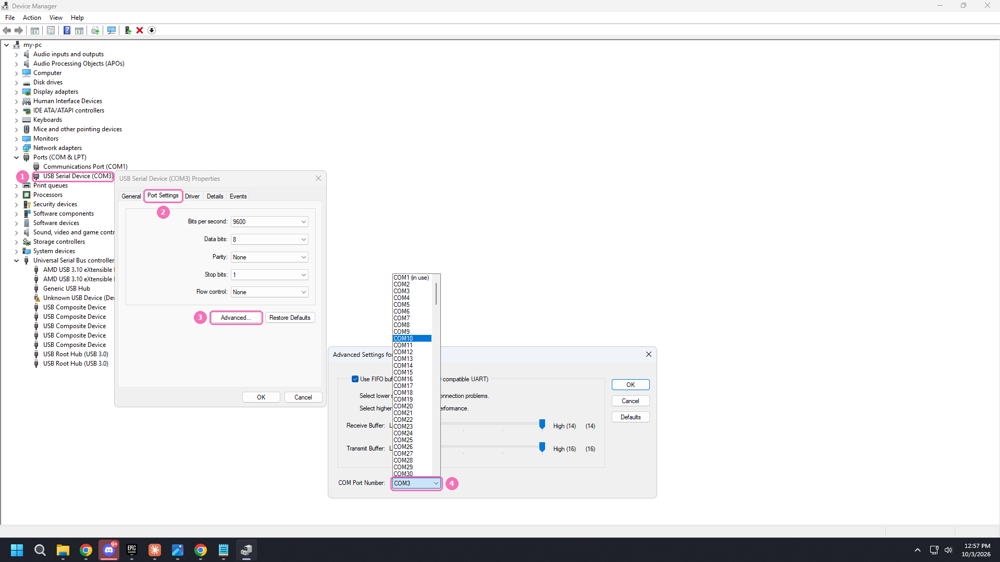

# Fixing a COM port 10 or higher

Some flashing tools only talk to COM ports numbered below 10. If your MAKCU or card shows up as COM 10, COM 14, and so on, move it down. This is a one-time fix per device.

MewTools shows a note on the **MAKCU and FERRUM** page when it spots a high COM number, with this same guide behind it.

## Move the port below 10

1. Press Windows key, type **Device Manager**, open it.
2. Open **Ports (COM & LPT)** (1). Find your device (the MAKCU is a USB-SERIAL CH343, the card's JTAG is a CH347).
3. Right click it, choose **Properties**.
4. Go to the **Port Settings** tab, click **Advanced**.
5. Open the **COM Port Number** dropdown (4) and pick a free number under 10 (COM 3, COM 4, and so on).
6. Click OK on both windows. If Windows says the number is in use, pick a different low number. It's usually safe, the old owner is often a device you no longer have plugged in.
7. Unplug the device and plug it back in. It should now show the new number.

## Back in MewTools
Open **MAKCU and FERRUM** again and the port picker will show the new number. Pick it and carry on with flashing.

## Tips
- Always plug the MAKCU into the same USB port, so Windows keeps the same COM number for it.
- If you swap USB ports a lot you may get a new high number again. Just repeat these steps.
