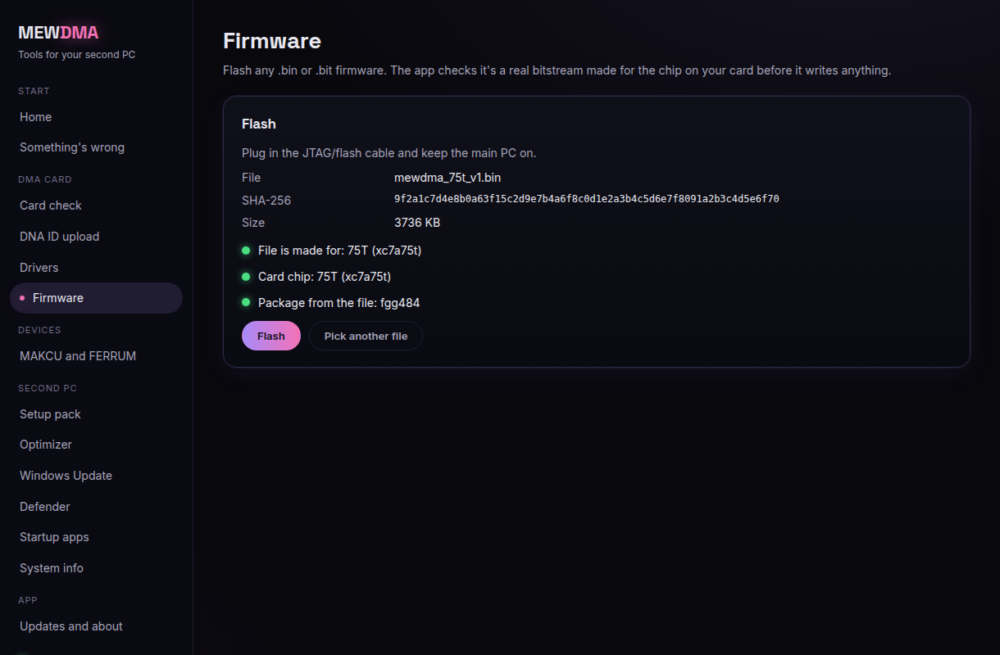
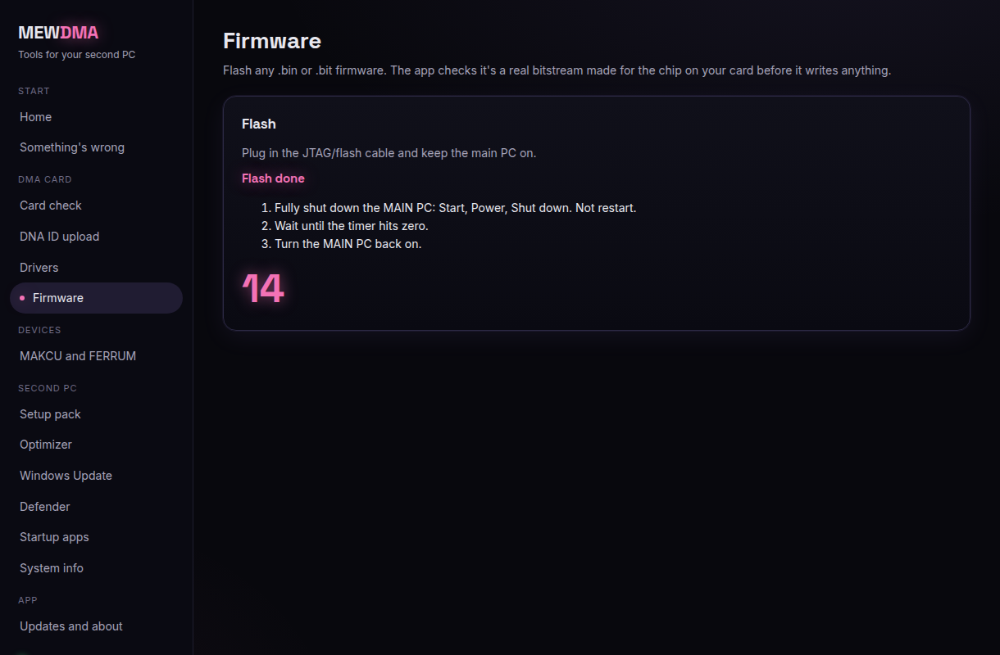

# Flashing firmware with MewTools

MewTools flashes any .bin or .bit firmware. Before it writes anything it checks the file is a real bitstream made for the chip on your card.

Keep the MAIN PC on the whole time and don't touch the cables while it writes.

## Steps

1. Open **Firmware** and click **Pick firmware file**. Pick the firmware from your order.

2. MewTools shows the file name, its SHA-256, and three green checks: the file's chip, your card's chip, and the package. If anything is red, it tells you why and won't flash.

   

3. Click **Flash** and confirm. It takes about a minute. Don't unplug anything.

4. When it's done, fully shut the MAIN PC down (Start, Power, Shut down, not restart), wait for the timer, then turn it back on.

   

5. Turn the main PC back on and check the card again.

## If the flash fails
- Keep the main PC on and replug the JTAG/flash cable, then click **Retry**.
- Wrong chip? MewTools blocks it and tells you which chip the file is for. Use the firmware made for your card.
