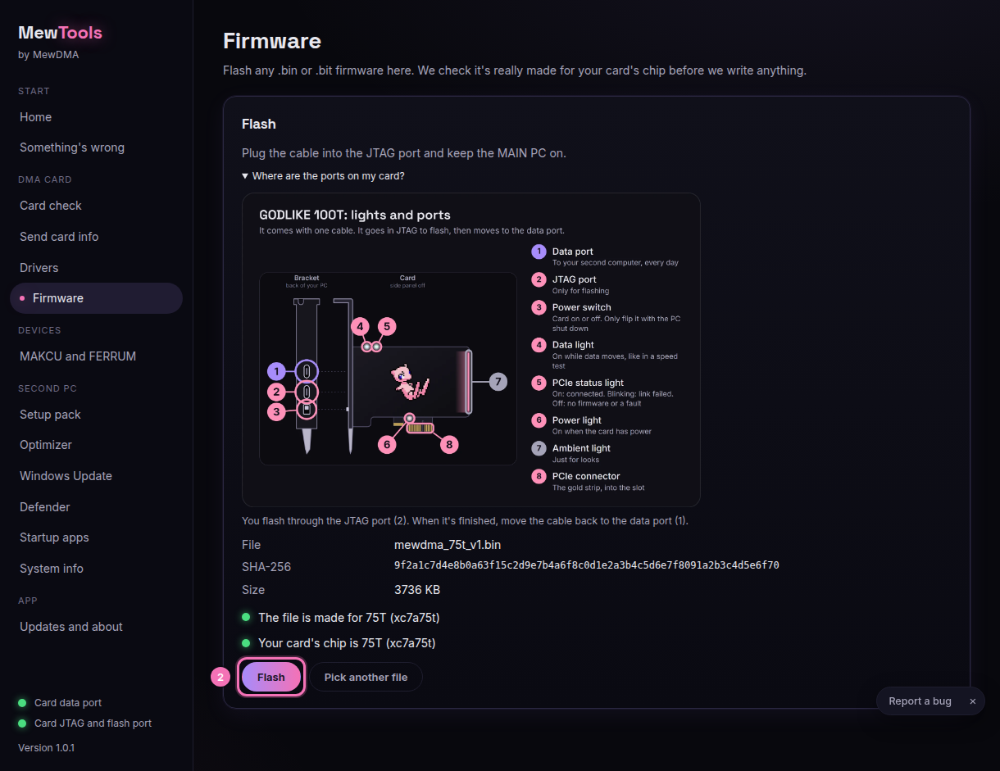
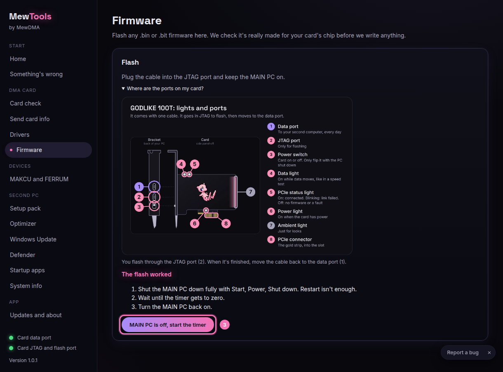

# Flashing firmware with MewTools

MewTools flashes any .bin or .bit firmware, but first it checks the file is a real bitstream made for your card's chip.

Keep the MAIN PC on the whole time, and don't touch the cables while it writes.

## Steps

1. Open **Firmware** and click **Pick firmware file**, then pick the firmware from your order.

2. MewTools shows the file name, its SHA-256 and three green checks for the file's chip, your card's chip and the package. If anything is red, it tells you why and won't flash.

3. Click **Flash** (2) and confirm. It takes about a minute, so don't unplug anything.

   

4. When it's done, fully shut the MAIN PC down (Start, Power, Shut down, not restart). Then click **MAIN PC is off, start the timer** (3) and wait for the ring to hit zero.

   

5. Turn the MAIN PC back on and check the card again.

## If the flash fails
- Keep the MAIN PC on, replug the JTAG/flash cable and click **Retry**.
- Wrong chip? MewTools blocks it and tells you which chip the file is for, so grab the firmware made for your card.
