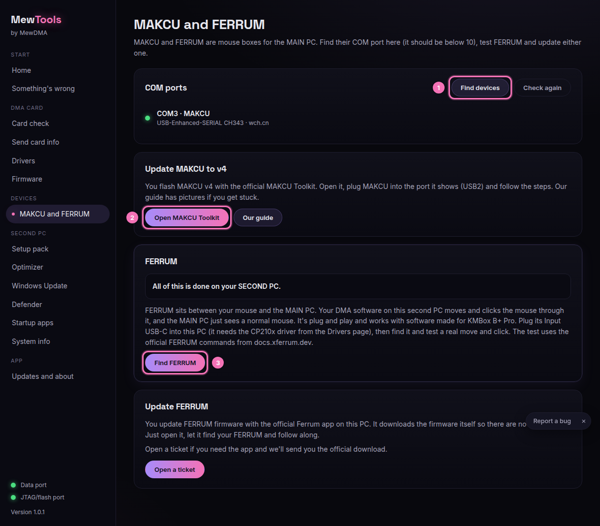

# Updating MAKCU to v4

You flash MAKCU v4 with the official MAKCU Toolkit, not with MewTools.

1. Open **MAKCU and FERRUM** in MewTools and click **Open MAKCU Toolkit**, or go to [makcu.com/toolkit](https://makcu.com/toolkit).
2. Plug the MAKCU into the port the Toolkit shows (USB2) and follow it.
3. Full steps with pictures are at [mewdma.net/guides/updating-makcu-to-v4](https://mewdma.net/guides/updating-makcu-to-v4).

The same page finds the MAKCU COM port too. It should be below 10, and the page shows how to fix it if it's not. For FERRUM, click **Find FERRUM**, then **Test mouse move** and **Test click**. MewTools sends a small move and a left click and asks if you saw them on the MAIN PC.
