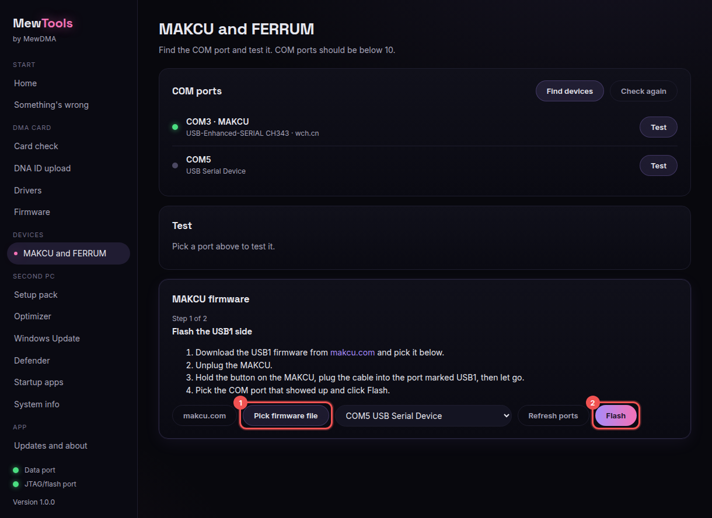

# Flashing MAKCU

MewTools walks you through both sides of the MAKCU, one at a time. Get the firmware from makcu.com first.

## Steps

1. Open **MAKCU and FERRUM**. Your MAKCU shows up as a COM port. If it's COM 10 or higher, MewTools shows you how to move it below 10. See [Fixing a COM port 10 or higher](fixing-a-high-com-port.md).

2. In the **MAKCU firmware** box click **Start** (1). The first time it grabs the free flasher tool.

   

3. Follow step 1 on screen for the **USB1** side: pick the USB1 firmware (1), unplug the MAKCU, hold the button, plug into the USB1 port, then pick the COM port and click **Flash** (2).

   

4. Do the same for the **USB3** side when it asks.

5. When both sides are done, unplug the MAKCU and plug it back in normally. Back on the test box, click **Test**, then **Run mouse test** and check your cursor moves.

## Tips
- Use the cables that came with the MAKCU.
- If a side fails, start that step again from step 1.
