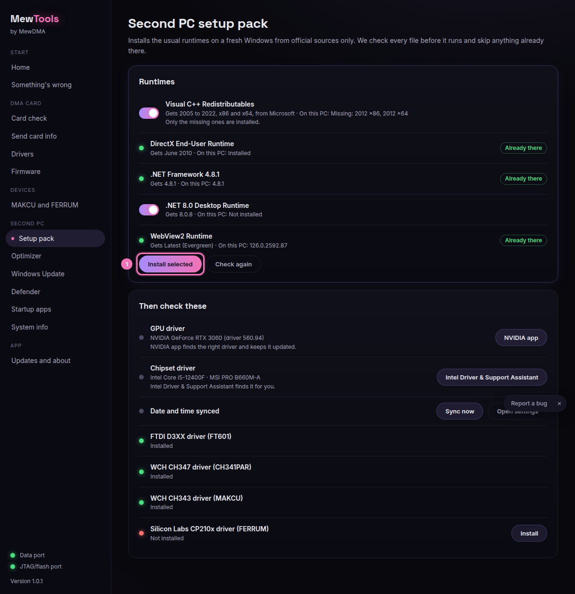

# Setting up a fresh second PC

Run MewTools as administrator and it gets a new Windows install ready for DMA in a few clicks.

## 1. Runtimes (Setup pack)
Open **Setup pack** and you'll see the common runtimes and what's already installed. Tick the missing ones and click **Install selected** (1). Everything comes from Microsoft and TechPowerUp, and anything you already have is skipped.

Then do the short checklist: update your GPU driver (NVIDIA, AMD or Intel), sync the date and time, and install the card drivers.

## 2. Drivers
Open **Drivers** and install FTDI, CH347 and CH343. See [Installing drivers](installing-drivers.md).

## 3. Optimizer
Open **Optimizer**. The **DMA second PC** group is on by default, so you get the high performance power plan, USB power saving off (so the card doesn't drop), sleep off, no update restarts while you're signed in and more. We make a restore point first and you can undo every change.

I'd leave the safe tweaks on. The optional ones (marked in amber) stay off unless you want them.

## 4. Check it works
Open **Something's wrong** and click **Check everything**. It checks the card, drivers, ports, power, network and monitors. Then **Copy summary** (1) gives you a summary to paste into a ticket.

