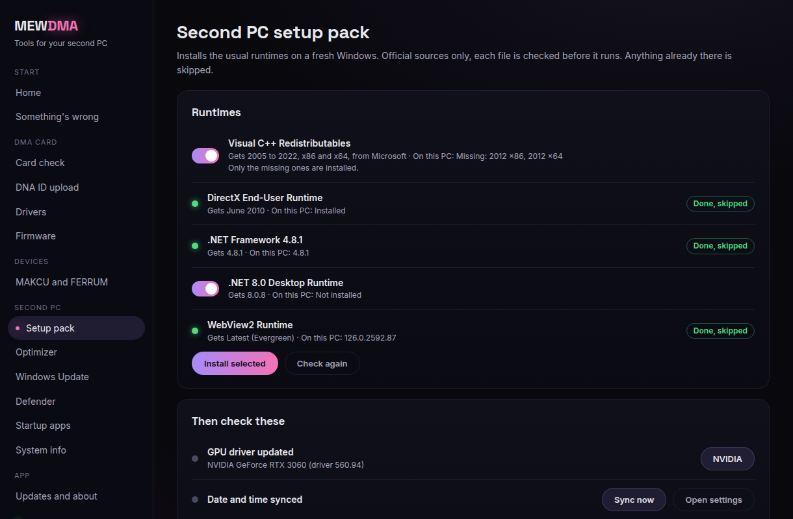
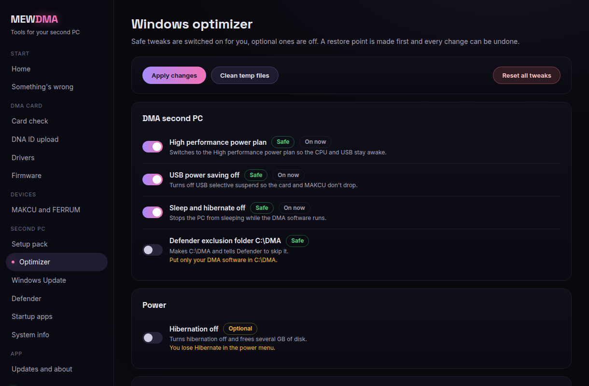
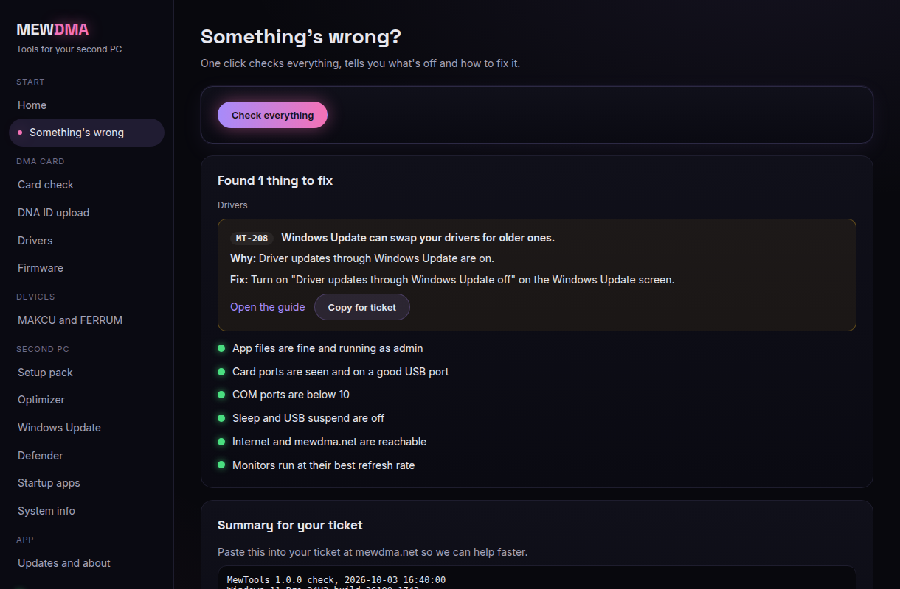

# Setting up a fresh second PC

New Windows install? MewTools gets it ready for DMA in a few clicks. Run MewTools as administrator.

## 1. Runtimes (Setup pack)
Open **Setup pack**. It shows the common runtimes and what's already installed. Tick the missing ones and click **Install selected**. Everything comes from Microsoft and TechPowerUp, and anything already there is skipped.

Then run the short checklist: update your GPU driver (NVIDIA, AMD or Intel), sync the date and time, and install the card drivers.

## 2. Drivers
Open **Drivers** and install FTDI, CH347 and CH343. See [Installing drivers](installing-drivers.md).

## 3. Optimizer
Open **Optimizer**. The **DMA second PC** group is on by default: high performance power plan, USB power saving off (so the card doesn't drop), sleep off, no update restarts while you're signed in, and more. A restore point is made first and every change can be undone.

Leave the safe tweaks on. The optional ones (marked in amber) are off unless you want them.

## 4. Check it works
Open **Something's wrong** and click **Check everything**. It checks the card, drivers, ports, power, network and monitors, and gives you a summary you can paste into a ticket.

That's it. Your second PC is ready.
