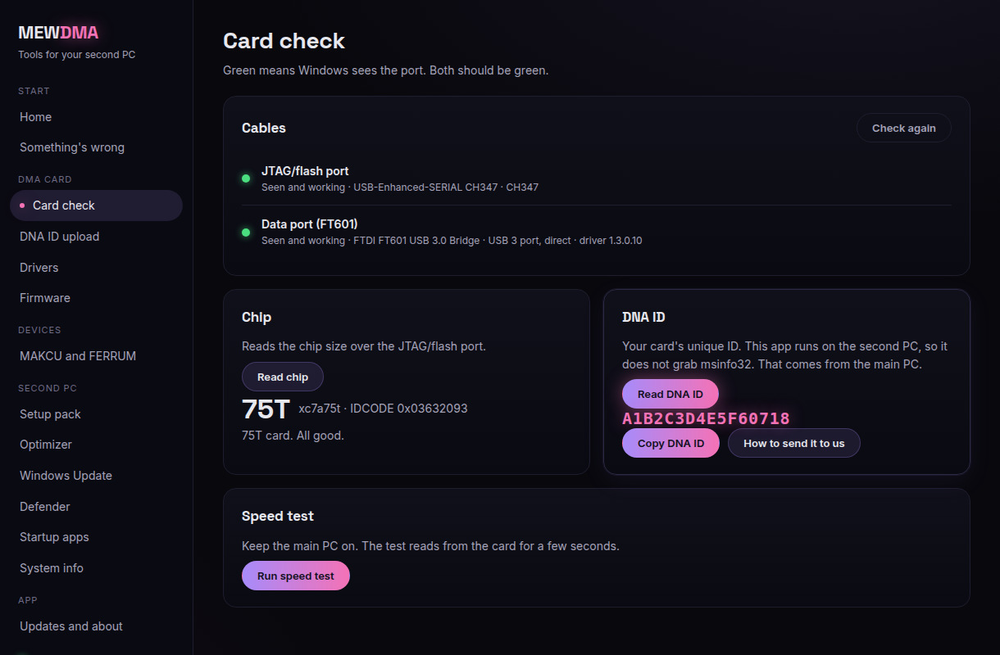

# Getting your DNA ID

Your DNA ID is your card's unique number. We need it (plus the msinfo32 file from your MAIN PC) to build your firmware. This runs on the SECOND PC, the one the card's cables plug into.

## Steps

1. Plug both card cables into the second PC and open MewTools. Go to **Card check**. Both dots should be green.

   

2. In the **Chip** box click **Read chip**. It should show your card's size (35T, 75T or 100T).

3. In the **DNA ID** box click **Read DNA ID**, then **Copy DNA ID**.

   

4. Click **How to send it to us** and follow the short guide to paste it into your order at mewdma.net.

That's it. Don't forget the msinfo32 file from your MAIN PC, it goes on the same order.

## If the DNA ID won't read
- Keep the MAIN PC on so the card has power.
- Replug the JTAG/flash cable.
- If it still fails, open **Something's wrong**, copy the summary, and send it with your ticket.
