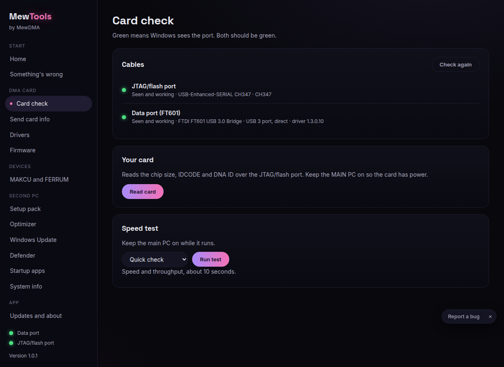
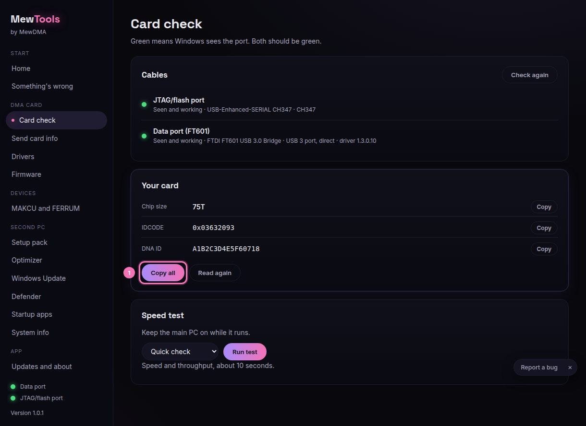
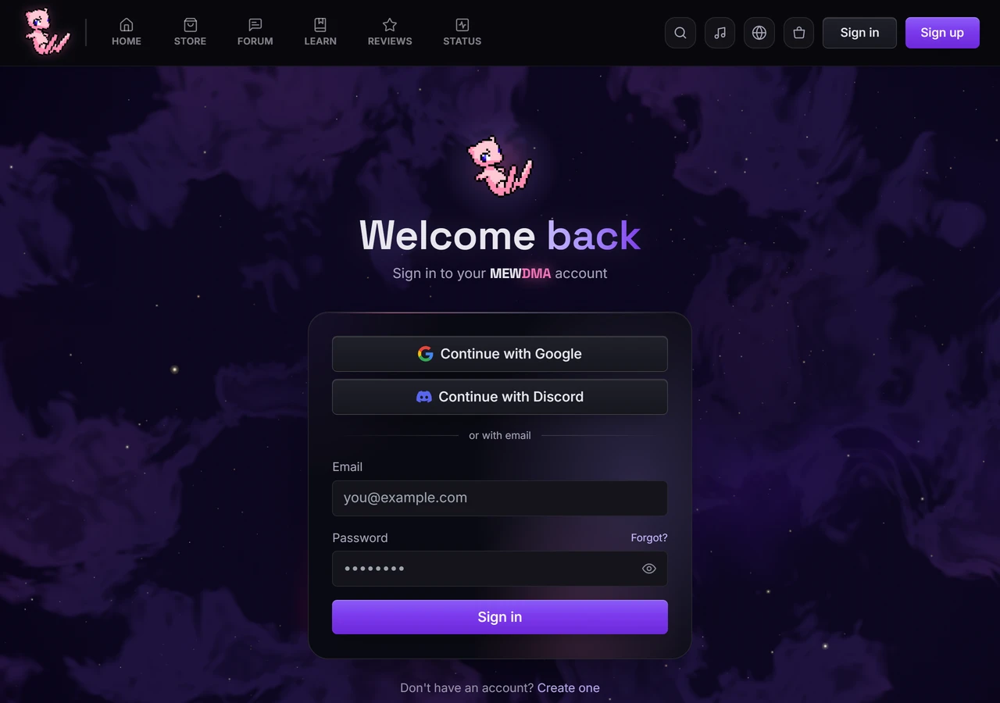
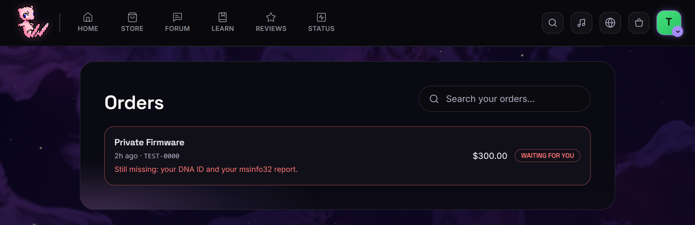
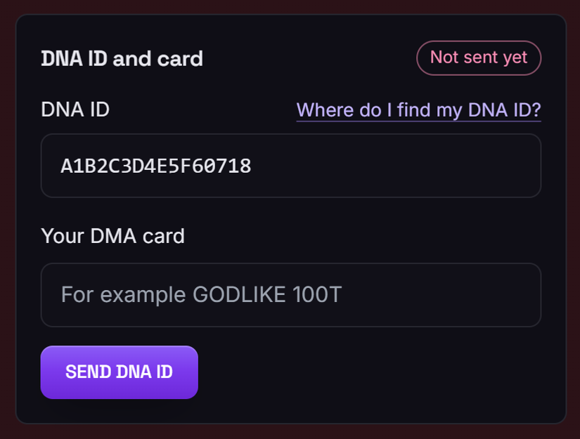
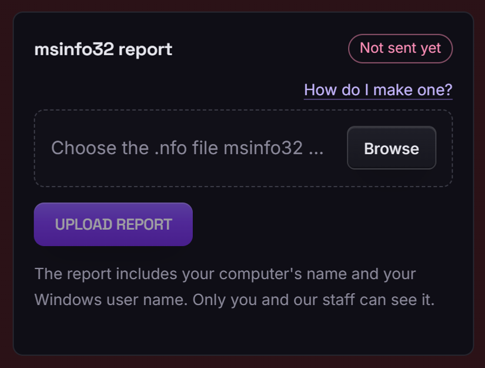

# Getting your DNA ID

Your DNA ID is your card's unique number. We need it to build your firmware. This runs on the SECOND PC, the one the card's cables plug into.

msinfo32 is only needed if your firmware provider asks for it. MewDMA does, so MewDMA customers also send an msinfo32 file from the MAIN PC. See [DNA ID and msinfo32](dna-id-and-msinfo32.md) for how to save it.

## Steps

1. Plug both card cables into the second PC and open MewTools. Go to **Card check**. Both dots should be green.

   

2. In the **Your card** box click **Read card**. It shows the chip size (35T, 75T or 100T), the IDCODE and the DNA ID.

3. Click **Copy** next to the one you need, or **Copy all** (1). Or open **Send card info** and send it straight to your order.

   

   The red numbers in the picture match the three clicks above.

4. Click **How to send it to us** and follow the short guide to paste it into your order at mewdma.net.

## Sending it to your order

1. Log in at mewdma.net with the account you ordered with.

   

2. Open **My orders** and open the order for your card.

   

3. Paste your DNA ID into the DNA ID box and save.

   

4. If msinfo32 is asked for, upload it from the MAIN PC to the same order.

   

That's it. If your provider asks for msinfo32 (MewDMA does), add that from the MAIN PC to the same order. See [DNA ID and msinfo32](dna-id-and-msinfo32.md).

## If the DNA ID won't read
- Keep the MAIN PC on so the card has power.
- Replug the JTAG/flash cable.
- If it still fails, open **Something's wrong**, copy the summary, and send it with your ticket.
