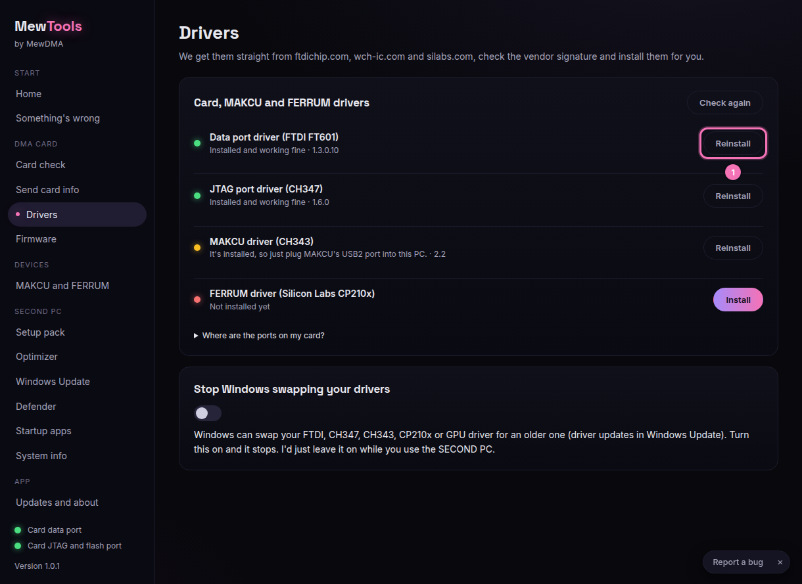

# Installing drivers

MewTools installs the card and MAKCU drivers straight from the official FTDI and WCH sites. It checks each file is signed before it runs.

## Steps

1. Open **Drivers**. Each driver gets a green dot if it's installed and a red dot if it's missing.

2. Click **Install** (1) next to any red one, and it downloads and installs by itself. If you're fixing a driver problem, click **Reinstall**.

   

3. Here's what each one is for:
   - **FTDI D3XX** is the card's data port (FT601).
   - **CH347** is the card's JTAG/flash port on newer cards.
   - **CH343** is the MAKCU.

## Stop Windows from swapping them
Windows can swap these for older drivers (driver updates in Windows Update). Open **Windows Update** in MewTools and turn on **Driver updates through Windows Update off**, and it stops.

## 35T cards with an FTDI JTAG port
Some 35T cards use an FTDI "Quad RS232-HS" for the JTAG/flash port, so MewTools shows a **Set up WinUSB** button on the Card check screen. Click it once and the flasher can talk to the card. You can undo it any time.
