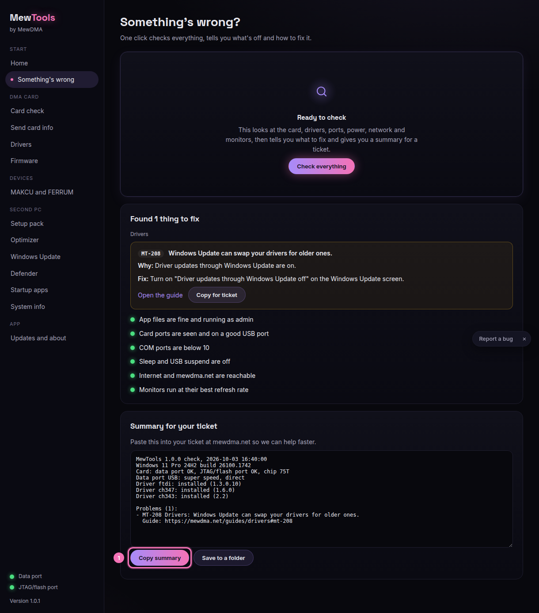

# Sending a Something's wrong report

When something isn't working, the fastest way for us to help is the report from the **Something's wrong** page. It checks the whole second PC in one go and hands you a summary to paste into your ticket. No personal files, just the card, drivers, ports, power, network and monitors.

## Steps

1. Open **Something's wrong** and click **Check everything**. It takes a few seconds.
2. Read the rows if you like. Green is fine, amber is a heads up, red is a problem. Each red one links to a guide.
3. Click **Copy summary** (1). The whole report is now on your clipboard.
4. Go to your order or ticket at mewdma.net, open your ticket, and paste it in (Ctrl+V). Add a line about what you were doing when it went wrong.

## What's in the report
- Card chip and DNA ID read result
- Driver versions (FTDI, CH347, CH343)
- Which USB ports the card is on and the speed
- Power plan and USB power saving
- Network and monitor checks
- MewTools version

## Good to know
- Keep the MAIN PC on when you run it, so the card has power and the card checks can run.
- The summary is plain text. You can read it before you send it.
- If a red row already links to a guide, try that first. A lot of issues fix themselves in a click.
