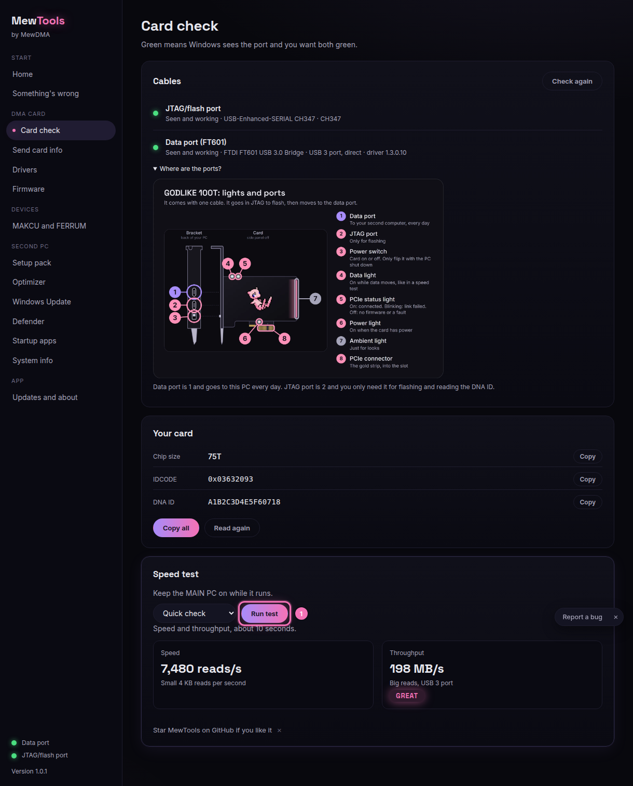

# Speed test ratings

The speed test reads from your card for a few seconds and gives you a read speed in MB/s plus a rating. Keep the MAIN PC on while it runs, because that's where the card gets its power and data.

Open **Card check**, pick a test and click **Run test** (1). Quick check measures both numbers. Speed is how many small 4 KB reads per second the card does, and throughput is MB/s on big reads. The rating is based on throughput. Stability runs each one for 60 seconds and shows min, average and max.

## What the ratings mean

The cutoffs depend on how your data port is plugged in. MewTools already knows if you're on a USB 3 or USB 2 port, so it rates you against the right set.

### USB 3 port (direct, the normal setup)

| Rating | Read speed |
| --- | --- |
| Fail | under 80 MB/s |
| OK | 80 to 140 MB/s |
| Good | 140 to 185 MB/s |
| Great | 185 MB/s and up |

### USB 2 port (or through a hub)

| Rating | Read speed |
| --- | --- |
| Fail | under 10 MB/s |
| OK | 10 to 18 MB/s |
| Good | 18 to 24 MB/s |
| Great | 24 MB/s and up |

You want Good or Great. OK still works fine, but you're leaving speed on the table. Fail means something is holding the card back.

## If you're on Fail or OK and expected more
- Plug the FT601 data cable straight into a USB 3 port on the back of the PC, not a hub and not a front port.
- The port should be USB 3 (blue, or labelled SS). Card check shows which one you're on.
- Close heavy programs on the second PC while you test.
- Run the **Optimizer** DMA second PC group, because it turns off USB power saving so the card doesn't get throttled.
- Make sure the FTDI D3XX driver is installed on the **Drivers** page.

If it still won't climb, open **Something's wrong**, copy the summary and send it with your ticket.
