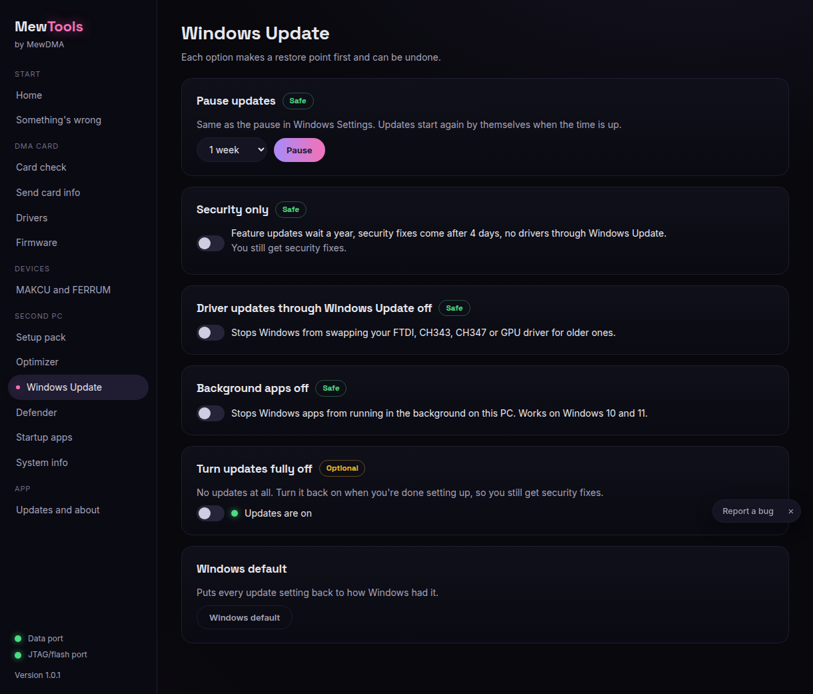
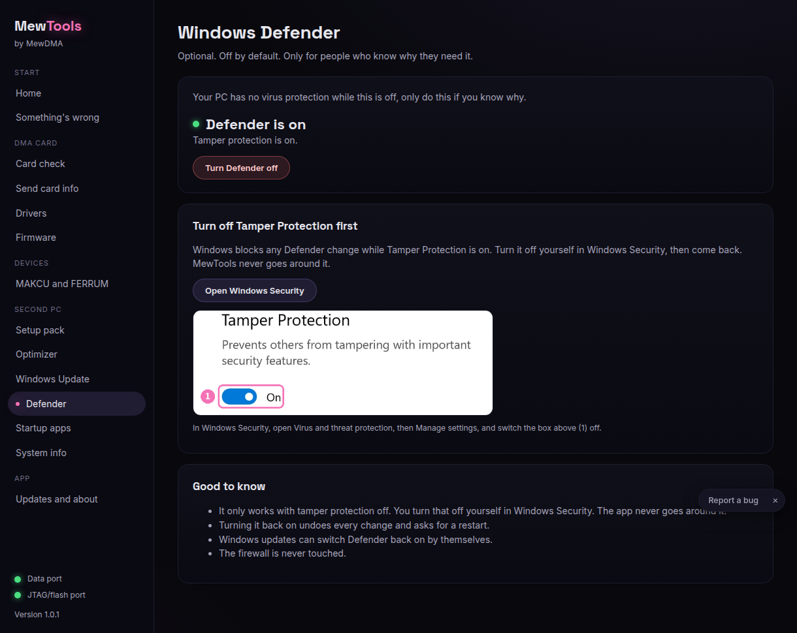
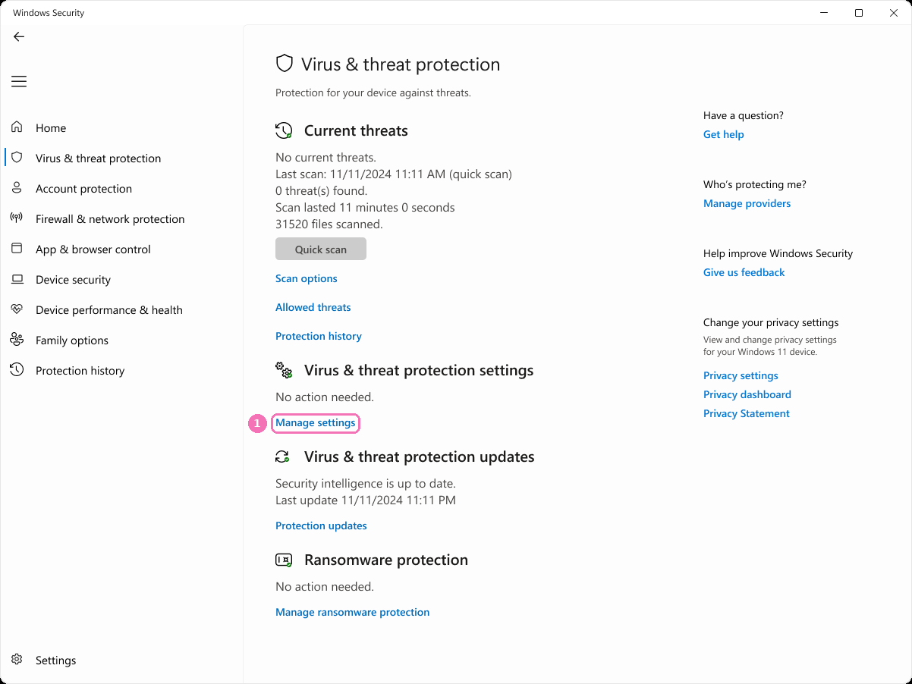
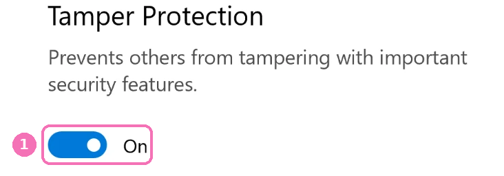

# Using the Windows Update and Defender pages safely

These two pages change real Windows settings. They're both optional and safe to leave alone. This guide says what each switch does so you only change what you mean to. MewTools always makes a restore point first and every change can be undone.

## Windows Update

Open **Windows Update**. Nothing here stops security updates. It only stops the parts that get in the way on a DMA second PC.

- **Driver updates through Windows Update off**: keeps Windows from swapping your FTDI, CH347 and CH343 drivers for older ones. Turn this on. It's the most useful switch on the page.
- **Pause feature updates**: holds back the big once-a-year Windows upgrades for a while. Normal monthly security fixes still come through.
- **Active hours**: stops surprise restarts while you're using the PC.

Leave real security updates on. If you ever want everything back to default, each switch flips the other way.

## Defender

Open **Defender**. This page is off by default and only for people who know why they need Defender off. Turning Defender off leaves the PC with no virus protection, so most people should skip this page.

If you do need it off:

1. Click **Open Windows Security**. Windows opens its own security window.
2. Go to **Virus & threat protection**, then click **Manage settings** (1).

   

3. Scroll to **Tamper Protection** and turn it off (1). Windows blocks every Defender change while Tamper Protection is on, and MewTools never goes around it. You turn it off yourself.

   
4. Come back to MewTools and click **Turn Defender off**.

To undo it, click **Turn Defender back on**. That puts everything back and asks for a restart. You can turn Tamper Protection back on in Windows Security too.

## The short version
- Windows Update page: turn on **Driver updates through Windows Update off**, leave the rest unless you have a reason.
- Defender page: most people never touch it. If you must, turn Tamper Protection off in Windows yourself first.
